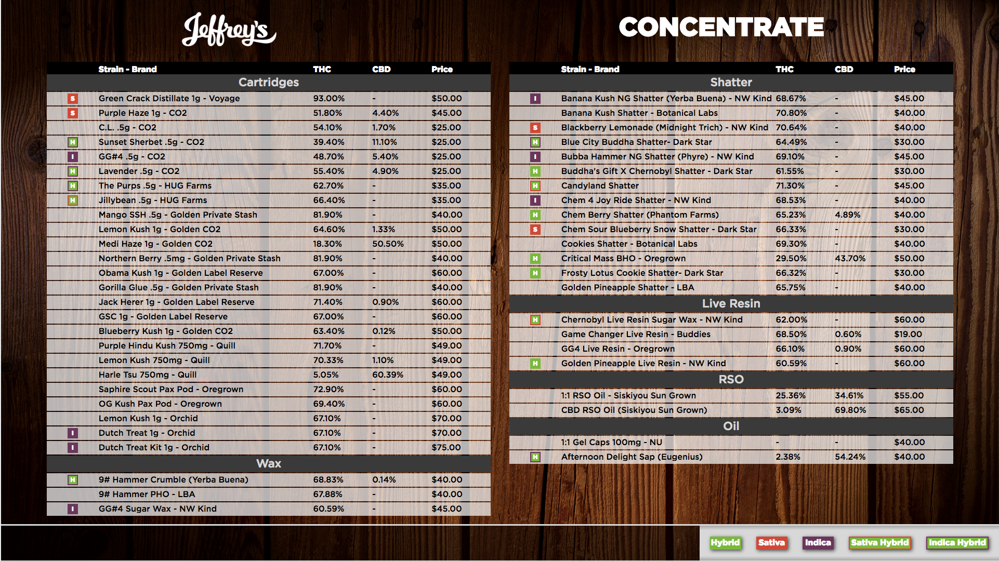

# _Jeffrey's TV Menu Display - Greenbits API Project_

## _Epicodus JavaScript Group Project_

#### By _Emily Wells Jiménez, Brandon Kudo, & Chris Turina_

###### _12.21.2017_

## Description

_Web app for TV display(1920x1080) to show Jeffrey's Flower and Oil dispensary menu. This app uses Greenbits API v1 to display Jeffrey's product offering. The app consists of 4 main components. The start screen, the flower screen, the concentrate screen, and the preroll screen. Each menu item provides detailed product information like: strain name, flower type, thc/cbd test results, price, and more! For more information on Jeffrey's flower and oil, [click here](http://jeffreysjoint.com/). For more information on Greenbits, check them out [here](https://www.greenbits.com/)._

## Screenshots

## Further Exploration

* Name check character length method for long names that mess with tables in menu
* Carouselling option for when product list goes over 60+ line items
* Edibles/Topicals menu
* Preroll menu rework for items that are come in different quantity amounts (ie: 2 pk, 3 pk, 5 pk, and .5 g vs 1 g amounts)
* Rewrite program in Angular 2

## Setup/Installation Requirements

1. _Clone [this repository](https://github.com/emilyjimenez/Jeffreys-GreenbitsAPI-Project.git) from Github in the terminal of your choice._

2. _Install [node.js](https://nodejs.org/en/) if you do not have it installed._

3. _To run the application and view in your preferred browser of choice, run the following commands once you're in the project directory in the terminal. 'npm install', 'bower install', 'gulp build', and 'gulp serve'. **note** Project will not build if you do not have a .env file set up with an API token. API tokens are available only to those who use the Greenbits POS software._

## Known Bugs

_If you press flower menu, then reload, and press concentrate menu the menu will load concentrates (wax shatter live resin) in the first column and then cartridges in the second column… should be vice versa. Work around is to hard reload the page if this happens._

## Technologies Used

* Atom
* HTML
* CSS
  * Sass
* JavaScript
  * JQuery
  * Node.js
    * Gulp
    * Bower
    * Babel
* Google Chrome
* [Greenbits API v 1](https://developer.greenbits.com/v1/)
* [Postman](https://www.getpostman.com/)

## License

_**Jeffrey's TV Menu Display - Greenbits API Project** is licensed under the Creative Commons Attribution-NonCommercial-ShareAlike License (CC BY-NC-SA) (as of 12/21/2017). For more information on this license, please checkout [creativecommons.org](https://creativecommons.org/licenses/by-nc-sa/4.0/)._

_Copyright (c) 2017 Emily Wells Jimenez (EWJ Consulting), Brandon Kudo, and Chris Turina_

## Contact Details

_Interested in this product? Email emily@jeffreysjoint.com, brandonkudo@gmail.com, or chris.turina@gmail.com for more information._
